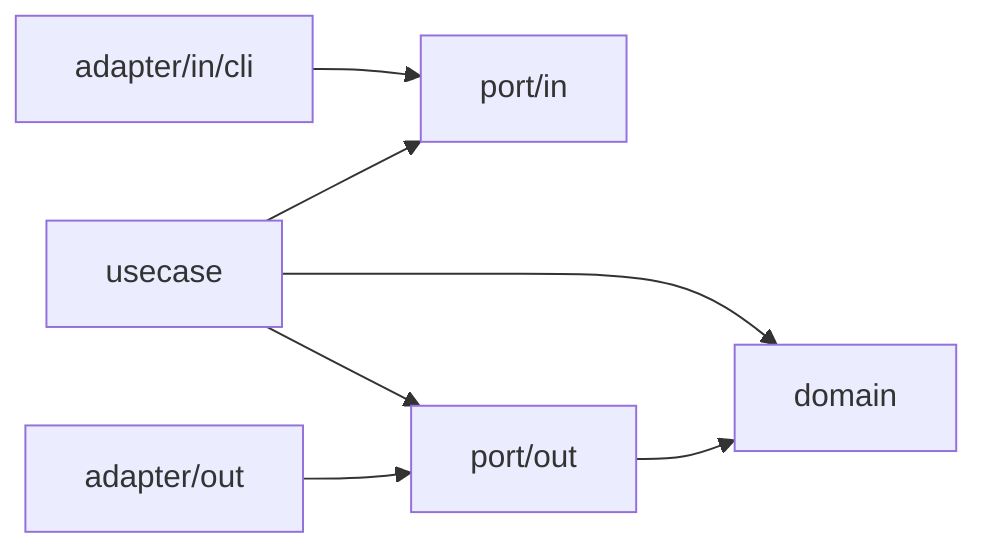

# ADR 0002: Hexagonal Transcription Boundaries

- Status: Accepted
- Date: 2026-09-08

## Context

The transcription package combined subtitle policies, workflow sequencing, command-line presentation, external processes, and filesystem persistence. Testing resume and retry behavior required fake executables and files even when the behavior under test was application policy.

The refactor preserves the single high-quality local pipeline established by ADR 0001, including its CLI, subtitle results, checkpoint compatibility, and output recovery behavior.

## Decision

Architectural roles are independent Go packages: `domain`, `usecase`, `port/in`, `port/out`, `adapter/in`, `adapter/out`, and `bootstrap`. Dependencies point toward the ports and domain. The domain contains cue, token, origin, speech interval, and chunk values, together with pure timing, cleaning, correction, reconciliation, validation, and retry-selection policies. It does not access files or processes.

The use-case package owns transcription, directory processing, batching, resume transitions, and retry orchestration. It implements the input ports and consumes the output ports. It does not import adapters, bootstrap, process APIs, flag parsing, or checkpoint serialization. Adapters do not import the use-case implementation package.

Input ports own `Transcriber`, `BatchRunner`, request validation, requests, results, and progress responses. Output ports describe audio processing, speech detection, recognition, checkpoint storage, transcript publication, input discovery, and per-job sessions. They own the resume-state contract and its invariant validation, which both storage and use cases apply. Input and output ports do not import each other. Use cases explicitly map an input request to a session request; directory parallelism remains a use-case concern. The neutral `port` package holds the output-collision error shared by CLI, use cases, and storage.

Arrows show source-code dependencies. At runtime, bootstrap injects output adapters into use cases, which call them through output ports.

Adapters provide these implementations:

- CLI parses flags and formats structured progress events, summaries, and exit codes.
- FFmpeg normalizes audio, probes the original media duration, and extracts bounded audio chunks.
- Whisper handles VAD, engine command arguments, output polling, JSON decoding, and inference resource limits.
- Filesystem handles input discovery, model and correction loading, checkpoint identities and serialization, atomic replacement, and safe transcript publication.
- Subtitle formats validated cues as TXT, SRT, or VTT and retains the existing pure subtitle-string utilities.

Bootstrap is the composition root. The command handles process arguments and cancellation signals and delegates to `bootstrap.Run`. Bootstrap connects the CLI to the input-port implementation and binds concrete per-file adapters through a session factory. Each session exposes narrow capabilities through output-port interfaces. One inference runner is shared by every session created by that factory; VAD and audio workers remain independently bounded. Audio handles in the use cases are local paths, while executable paths, engine flags, model resolution, and serialized payloads remain adapter details.

## Compatibility Contracts

- SRT main and retry batches remain capped at 128. TXT and VTT retain a single main multi-input inference run.
- Recognition returns one result slot per input chunk, including empty results, and preserves the original chunk index and timeline.
- Extracted audio batches expose an optional release callback through the output port. Use cases release main audio after recognition and each retry batch before extracting the next, including on recognition failure. The FFmpeg adapter owns deletion of its batch directory and cleans failed extractions immediately; session cleanup remains the fallback. Release failures produce warnings without replacing the transcription result.
- Progress reported from completed JSON files is informational. Durable progress advances only after the whole batch succeeds and its results are decoded.
- Partial SRT is cleaned, validated, and written before its raw-cue checkpoint. Corrections are reapplied when resuming, without recognizing completed audio again.
- Checkpoint names, JSON fields, nanosecond durations, schema version 1, pipeline version 4, and file identities remain unchanged. Resume stage and cursor invariants belong to the output-port contract; transitions belong to use cases, while encoding and path-specific errors belong to storage.
- The retry cursor indexes the entire raw cue sequence. Retry candidates preserve the original cue origin and existing confidence thresholds.
- Existing output files remain protected against races. Unsupported hard links use exclusive copying. A failed publication preserves the completed temporary transcript, and session cleanup does not delete it.
- Successful final publication is followed by progress-artifact cleanup. Cleanup errors are reported without changing the successful transcription result.
- Context cancellation reaches active external commands and prevents queued work from starting.

## Validation

Domain tests cover pure policies and input preservation. Use-case tests use in-memory capabilities to exercise batching, retries, resume, cancellation, and storage failures. Adapter tests verify the external contracts and a literal checkpoint fixture from the previous implementation. Integration tests run the same bootstrap path as the command and retain the existing fake-executable scenarios, including shared GPU execution limits and output collision recovery.

Architecture tests reject infrastructure imports in the domain, use cases, and ports; cross-direction port dependencies; and adapter imports of use cases or bootstrap. They require the command to depend on bootstrap and reject reintroduction of `internal/app`, `internal/application`, and `internal/adapters`. `make test` runs uncached race-enabled tests with aggregate cross-package coverage and requires at least 80%. `make check` verifies formatting and runs vet. `make build` builds the existing command.

## Consequences

Use-case policy can be tested without local media tools or files. Changes to command flags, JSON schemas, storage mechanics, or presentation have explicit owners. Separate input and output contracts require a small request mapping but prevent adapters from depending on workflow implementations. The job-session factory keeps per-file resources out of use-case code while sharing expensive execution limits.

No dependency-injection framework, event bus, cloud backend, new quality mode, or public API is introduced.
